<!-- Generated by GitHub Profile Agent Console. Edit profile.config.json, then run npm run generate. -->

  <picture>
    <source media="(max-width: 760px) and (prefers-color-scheme: dark)" srcset="./assets/hero/agent-console-2feca10f-mobile-dark.svg">
    <source media="(max-width: 760px)" srcset="./assets/hero/agent-console-2feca10f-mobile-light.svg">
    <source media="(prefers-color-scheme: dark)" srcset="./assets/hero/agent-console-2feca10f-dark.svg">
    <source media="(prefers-color-scheme: light)" srcset="./assets/hero/agent-console-2feca10f-light.svg">
    
  </picture>

  

## About Me

I build practical software systems with a focus on web development, application engineering, and data-driven solutions.

My work combines software engineering with continuous learning in data integration, mobile development, AI-assisted development, and modern developer tools.

## Current Focus

| Area | What I am exploring |
| --- | --- |
| **Software Engineering** | Designing and building practical web applications with maintainable architecture, clean interfaces, and reliable functionality. |
| **Data & Integration** | Working with relational databases, data processing, ETL workflows, and system integration. |
| **AI-Assisted Development** | Exploring how AI tools can improve software development workflows, problem solving, productivity, and system design. |

## Featured Work

| Project | Focus | Why it matters |
| --- | --- | --- |
| [**Library Management**](https://github.com/retone-hub/library-management-system) | Library management application | An ongoing software project for managing library operations, designed to explore practical application architecture, database management, and user workflows. |
| [**Maintenance System**](https://youtu.be/dQw4w9WgXcQ?si=6aLiUQacLLAWIXhc) | Maintenance management application | A web application for managing maintenance work orders, equipment information, and operational workflows. |

## Research Direction

I am interested in building software that solves real-world problems through clean engineering practices, practical system design, data integration, and responsible use of modern AI tools.

## Tech Stack

`PHP` · `CodeIgniter 4` · `Laravel` · `JavaScript` · `Tailwind CSS` · `PostgreSQL` · `Flutter` · `Dart` · `Pentaho Data Integration` · `Git` · `GitHub`

## Recent Activity

<!-- AUTO:ACTIVITY:START -->
_Recent public activity will appear here after the workflow runs._
<!-- AUTO:ACTIVITY:END -->

---

  Building practical software, learning continuously, and exploring better ways to build with technology.

